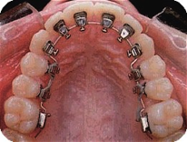
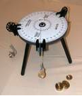

# Force as Vectors

### Additional Equipment

- Force table with three pulley clamps
- Various hooked weights

### Objectives

Lab Skills

- 
  - Uncertainty propagation
  - Measurement Precision
  - Significant figures

- Agreement in measurements based on uncertainty

Physics Concepts

- Adding and subtracting forces as vectors in 2 dimensions
- Applying Newton's 2nd law to situations of static equilibrium
- Drawing and interpreting free-body diagrams

### Conceptual (C-Level) DONE BEFORE LAB

- Lingual braces are braces attached on the inside of the teeth, and are considered desirable by some wearers because they are hidden from view. In the picture below, the braces have been tightened so that they exert a net force of 1.2 N due south on the tooth circled. The neighboring teeth exert a total force of 0.5 N at 30$^\circ$ west of north. You want to develop a general formula (no numbers!) for the force the gum exerts on the tooth. Use the problem solving sheet as discussed in class and work with your group to find a solution.

### Basic Lab (B-level):

You will be experimentally checking your answer to the C-Level lab using the Force Table provided to you.

- You need to set up an appropriate "scale". Though mass (kg or g) and weight (N) are not the same thing, the weight of an object is proportional to its mass. As an example, you may let a mass of 120 g "represent" 1.2 N. Be sure to include your scale in your report, as well as the angles and masses set up on the table.
- Check your solution by setting up the forces on the force table and see if they balance out. Can you remove the central pin and have your three forces hold the ring stationary?
- Using your force table setup, experimentally determine the uncertainty in the measured force of the gums on the tooth. As a group, try to come up with at least 2 ways to estimate the uncertainty. Pick one and record your best value and uncertainty for this quantity in the appropriate way.

- Determine whether your theoretical value and experimental value are in agreement. As always, be sure to explain your answer.

### Advanced/Extended Lab Ideas (A-level):

- Move one of the masses by 30 degrees and experimentally determine the new force (a fourth weight) needed to bring the system into equilibrium again. Compare your result with a theoretical prediction.

- Propose and carry out an experiment on something you are curious about (get your lab instructor's approval first)

\eject

