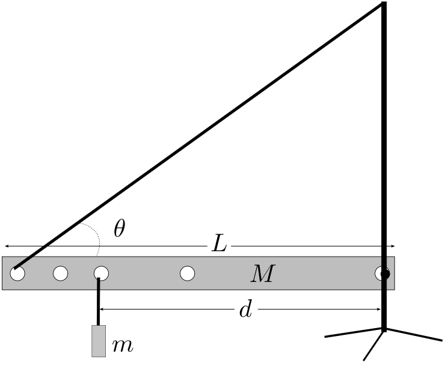

# Boom Crane and Human Arm

## Additional Equipment

- "flagpole" , or board with various drilled holes
- Wire/string

## Objectives

Lab Skills

- Uncertainty propagation
- Measurement Precision
- Significant figures
- Agreement in measurements based on uncertainty

Physics Concepts

- Static equilibrium situations with torques (Newton's 2nd Law for rotation)
- Addition of torques

## Conceptual (C-Level) DONE BEFORE LAB

A crane is equipped with many safety features, such as radar to locate the position of the hook and a sensor to monitor the tension in the support wire. The designers want to program the tension sensor to anticipate the tension given the load on the crane and the distance from the mast.

- Draw a force diagram for the simplified crane model. Discuss this in your report.
- Work out an equation for the tension in the supporting cable. Your resulting equation can only depend on the following variables: the amount of mass on the crane ($m$); the mass of the crane arm ($M$); the distance of the mass from the crane mast ($d$); the angle that the cable makes with the crane arm ($\theta$); the length of the crane arm ($L$).

## Basic Lab (B-level)

To test your solution, you will construct the model crane using the materials provided.

- Choose a single mass and place it on 5 different board locations (d). Again, both compute (using your C-level result) and measure the tension in the cable. Plot the measured and calculated tensions as functions of mass m. Don't forget uncertainty!

## Advanced/Extended Lab Ideas (A-level) (Choose ONE)

Our experimental setup for the crane can be easily modified to model the human forearm, with the wire representing the tendon that attaches close to your elbow, and the crane arm representing your forearm.

- Modify your crane setup so that it models a human arm
    - Repeat your analysis from C and B level (find how the tension in your tendon changes as you support a mass farther and farther out from your elbow).
    - What do you notice about the tension in this situation compared to that of the crane? Can you explain this?
- Propose **and carry out** an experiment on something you are curious about (get your lab instructor's approval first).

\eject

